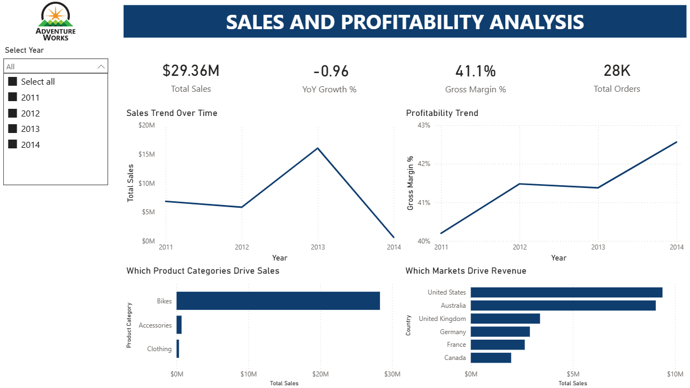

# Sales & Profitability Analysis Dashboard (Power BI)

## 📌 Project Overview
This project is an end-to-end **Business Intelligence solution** built using **Power BI and SQL Server**, focused on analyzing **sales performance, profitability, and growth trends**.

The goal of this project was not just to build visuals, but to apply **real-world BI practices**:
- Clean data modeling
- Correct DAX logic
- Time intelligence with edge-case handling
- Executive-focused dashboard design

This dashboard answers key business questions such as:
- How is sales performance trending over time?
- Are we growing year-over-year?
- Is growth profitable?
- Which products and regions drive performance?

---

## 🎯 Business Objectives
- Analyze overall sales and profitability performance
- Compare Year-over-Year (YoY) growth accurately
- Track margin trends to assess business efficiency
- Identify key product categories and geographic drivers
- Design an executive-friendly dashboard for decision-making

---

## 🛠️ Tools & Technologies
- **Power BI Desktop**
- **SQL Server (AdventureWorks dataset)**
- **DAX (Data Analysis Expressions)**
- **Power Query**
- **Dimensional Modeling (Star Schema)**

---

## 🧩 Data Modeling
The project follows a **star schema** with a single fact table and multiple dimensions:

### Fact Table
- FactInternetSales  
  - Sales Amount  
  - Quantity  
  - Total Product Cost  
  - Order-level granularity  

### Dimension Tables
- DimDate (marked as Date table)
- DimProduct  
- DimProductSubcategory  
- DimProductCategory  
- DimCustomer  
- DimGeography  

All relationships are **one-to-many**, single-direction, and optimized for analytical correctness and performance.

---

## 📐 Key DAX Measures
Core measures built in this project include:

- Total Sales  
- Total Orders  
- Total Customers  
- Average Order Value (AOV)  
- Total Cost  
- Gross Profit  
- Gross Margin %  

### Time Intelligence
- Sales YTD  
- Sales Last Year  
- YoY Growth (₹)  
- YoY Growth % (analytical version)  
- YoY Growth % (KPI version with controlled context)

Special care was taken to:
- Avoid misleading totals
- Handle partial-year comparisons
- Separate analytical measures from KPI-specific logic

---

## 📊 Dashboard Design
The dashboard was designed for **executive consumption**, following best practices in data storytelling.

### Dashboard Sections
1. **KPI Summary**
   - Total Sales
   - YoY Growth %
   - Gross Margin %
   - Total Orders

2. **Trend Analysis**
   - Sales trend over time
   - Profitability (margin) trend

3. **Drivers Analysis**
   - Sales by Product Category
   - Sales by Country
   - Margin insights via tooltips

Visual interactions were carefully controlled to prevent misleading cross-filtering.

---

## 🔍 Key Insights
- Sales showed significant volatility across years, with a noticeable drop in partial-year data
- Gross margin improved slightly over time, indicating better efficiency despite sales fluctuations
- Product mix and geographic distribution played a major role in performance changes
- Time intelligence analysis highlighted the importance of comparing like-for-like periods

---

## 📸 Dashboard Preview
Screenshots of the dashboard are available in the `/dashboard` folder.

---

## 🚀 What This Project Demonstrates
- Strong understanding of **BI fundamentals**
- Real-world **data modeling and DAX skills**
- Ability to handle **time intelligence edge cases**
- Focus on **business questions**, not just visuals
- Executive-level **dashboard design and storytelling**

---

## 📬 Next Steps
This project is part of my growing analytics portfolio.  
I plan to extend this work with:
- Advanced time intelligence (rolling metrics)
- Customer segmentation analysis
- Forecasting and scenario analysis

---

**Feedback and suggestions are always welcome.**
